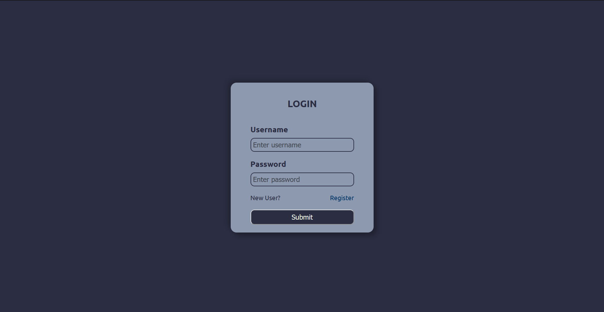
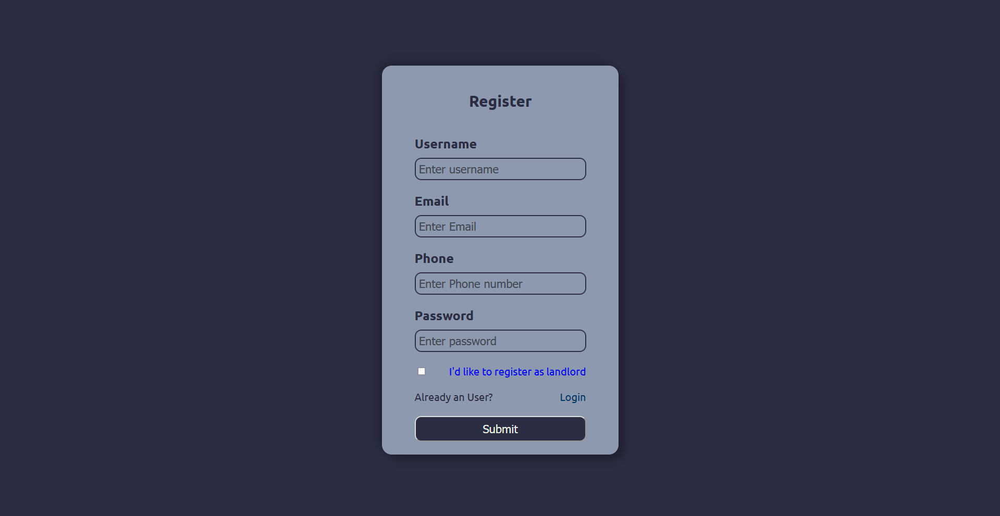
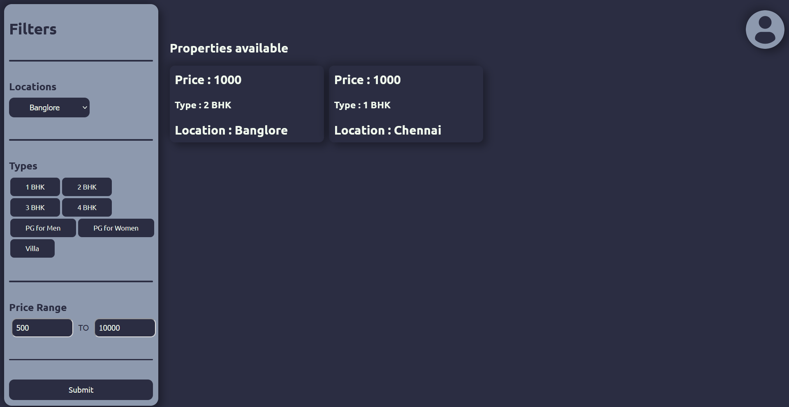
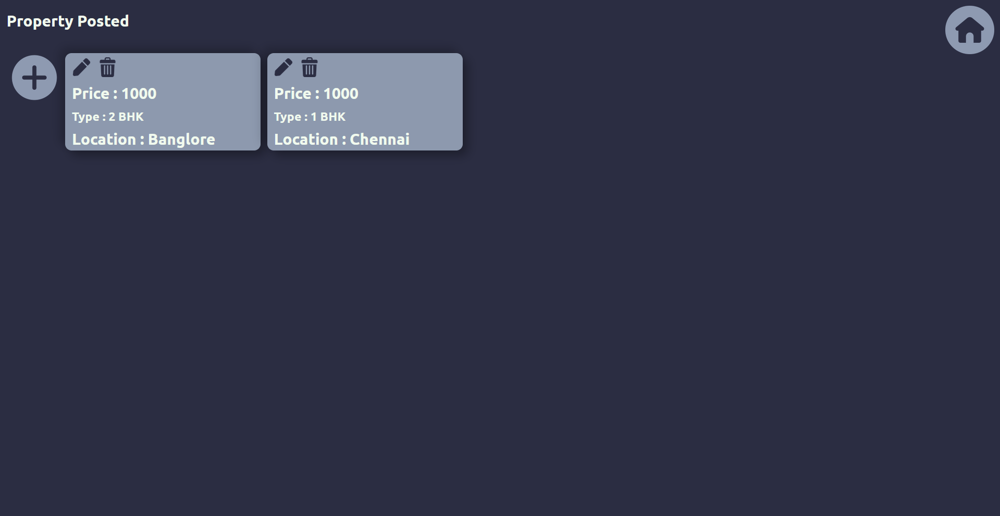
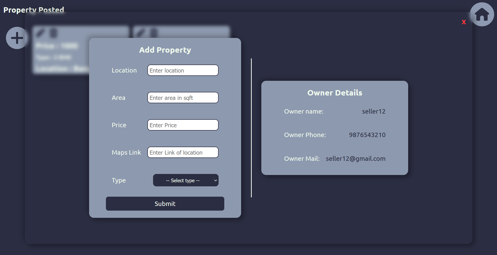

# RENTIFY

Link to application - [Rentify](https://rentify-orcin-two.vercel.app/property)

### Description

A full stack web application built with MERN stack involving the combination of people who look for houses or PG hostels to rent and the landlored who like to help these people know that they are open for contacting.

### Flow of application

-   Buyers

    -   Register
    -   Login
    -   Explore the places available for buying / renting posted by people, by clicking on them we can see the location link as well as contact details of owners
        -Fitlering option is also available for minimizing the choices
    -   Logout

-   Seller
    -   Register
    -   Login
    -   Post property details and their own details are managed in cookies
    -   They can update or delete these properties
    -   They can also do all functionalities of buyers
        -Logout

### Tech Stack and tools used

```
Front-end:
- HTML
- SCSS
- JS
- React

API:
- EXPRESS JS

Server-side:
- MongoDB

Testing:
- Postman

Design:
- Figma

Hosting:
- Vercel

Version control:
- git
- Github
```

### Specifications

```
Browsers specs:
- Resolution : 1920 x 1080 / 1920 x 1200
- Zoom : 100%
- Running OS : Windows
- Recommended Browser : Firefox, Opera, Chrome
```

### Screen shots

Login page



Signup page



Home page



Properties page only for seller



Adding properties



### Contact

Athidya U

<a href="mailto:athidya23.03.2003@gmail.com">Mail</a>
